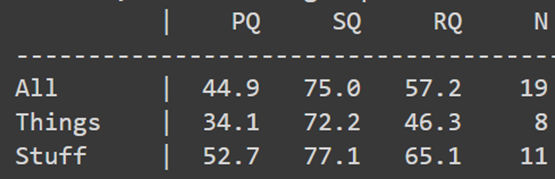

# Panoptic Segmentation using SOLO

<!-- Panoptic segmentation is a scene understanding problem that combines the prediction from both instance and semantic segmentation into a general unified output.
This project implements a location-based panoptic segmentation model, modifying the state-of-the-art EfficientPS architecture by using SOLOv2 as the instance segmentation head instead of a Mask-RCNN. -->

## Novelty

We replace the Mask-RCNN architecture from the instance head with a SOLOv2 architecture in order to improve the instance segmentation of the EfficientPS model.\
The Mask-RCNN losses now will be replaced by SOLOv2’s Focal Loss for semantic category classification and DiceLoss for mask prediction.\
This approach of using a location-based instance segmentation for panoptic segmentation will improve upon the performance metrics.

## Results
<!--  -->

Early research explored various techniques for Instance segmentation and Semantic segmentation separately. Initial panoptic segmentation methods heuristically combine predictions from state-of-the-art instance segmentation network and semantic segmentation network in a post-processing step. However, they suffered from large computational overhead, redundancy in learning and discrepancy between the predictions of each network.\
Recent works implemented top-down manner with shared components or in a bottom-up manner sequentially. This again did not utilize component sharing and suffered from low computational efficiency, slow runtimes and subpar results.\
EfficientPS:
- Shared backbone: EfficientNet
- Feature aligning semantic head, modified Mask R-CNN
- Panoptic fusion module: dynamic fusion of logits based on mask confidences
- Jointly optimized end-to-end, Depth-wise separable conv, Leaky ReLU
- 2 way FPN : semantically rich multiscale features -->

